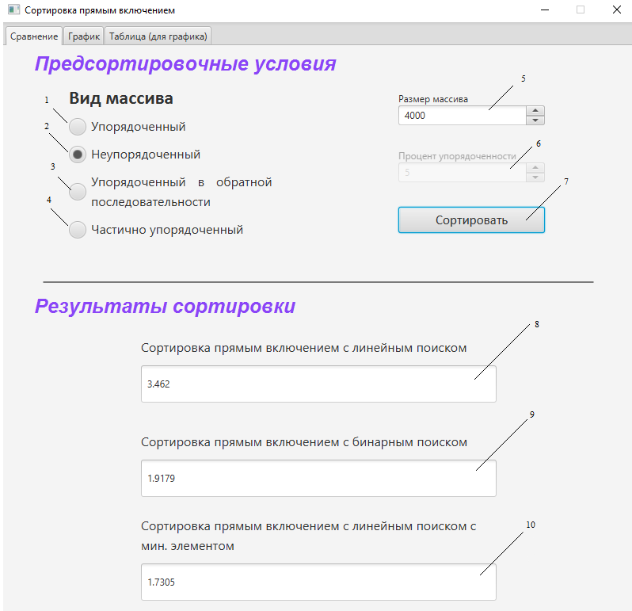
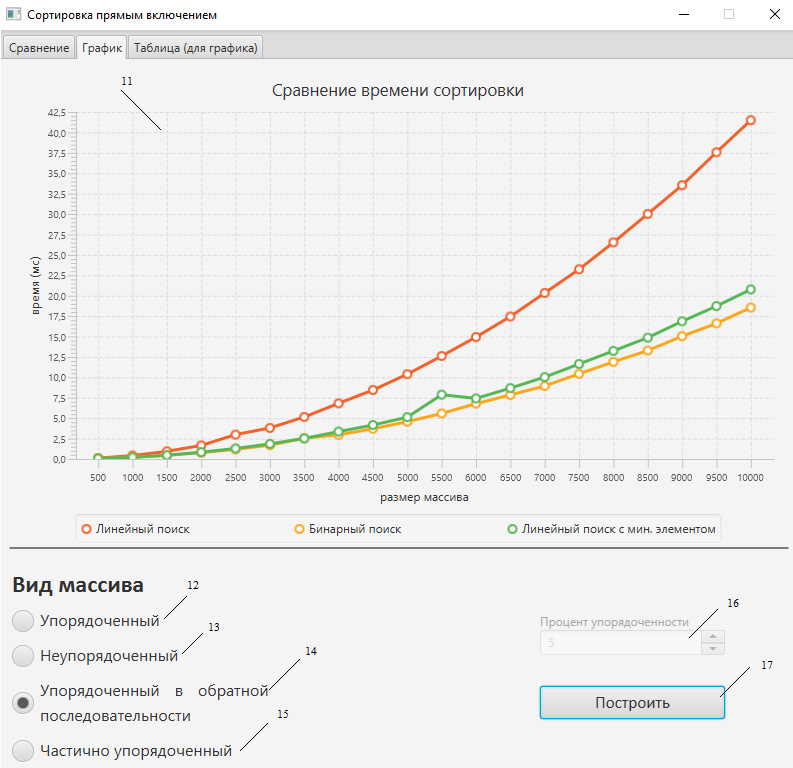
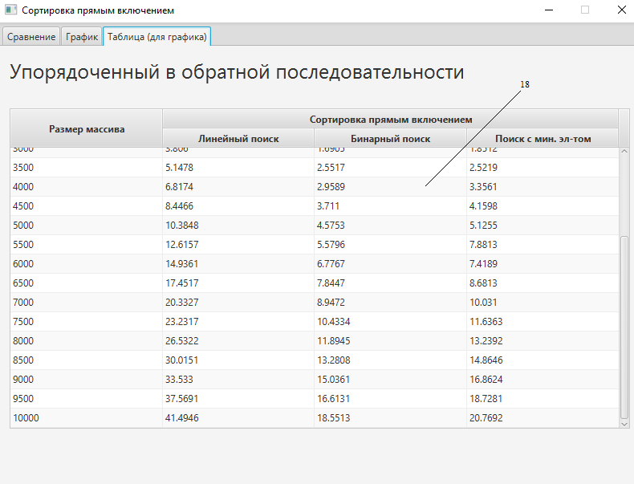

# Курсовая работа «Сравнение и анализ алгоритмов сортировки методом прямого включения»

## Задание
1. Запрограммировать следующие алгоритмы сортировки:
   1. Классическое прямое включение;
   2. Сортировка с двоичным включением;
   3. Оптимальное прямое включение (добавление барьера) 
2. Выполнить сравнение времени сортировки перечисленными выше методами
   1. Неупорядоченный массив;
   2. Упорядоченный массив;
   3. Упорядоченного в обратной последовательности массива;
   4. Частично упорядоченного массива (процент упорядоченности задается на форме)
3. Данные отобразить в табличной и графической формах.
   
## Результат

### Сравнение

### График

### Таблица
