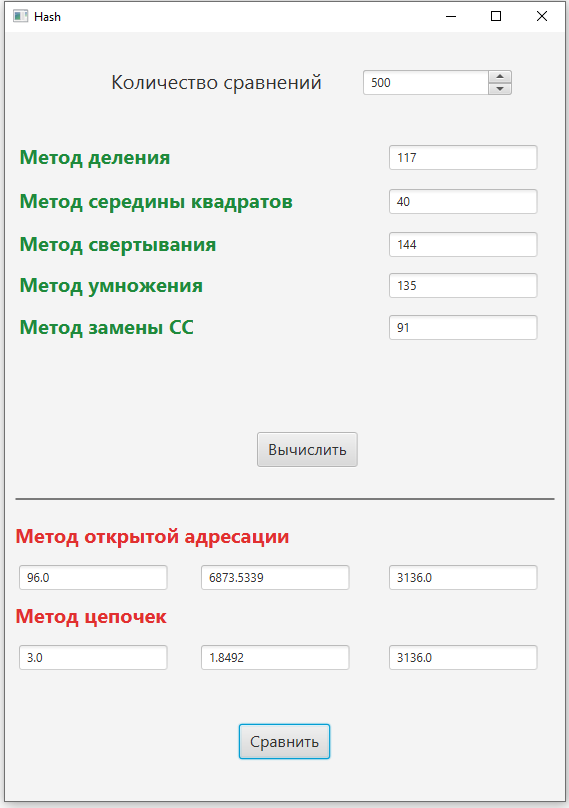

# Лабораторная работа № 3 Хеширование

## Задание
1. Написать функции получения хеш-адреса для рассмотренных выше
методов деления, середины квадратов, свертывания, умножения и
универсального хеширования.
2. Сгенерировать массив М из 1000 случайных чисел, значения которых
находятся в диапазоне от 0 до 65000.
3. Используя метод цепочек, определить наиболее эффективную функцию
хеширования. Для этого, последовательно применяя каждую из указанных в п.1
хеш-функций, заполнять цепочки ключами из массива М, подсчитывая
количество коллизий. На вход каждой из хеш-функций должна подаваться
**одна и та же последовательность ключей**.
4. Увеличить счетчик лучшей функции на 1.
5. Выполнить шаги 2, 3 и 4 n раз (n≥100) (количество итераций задается на
форме).
6. Вывести счетчики для каждой функции хеширования.
7. Написать программу оценки временных характеристик поиска ключей
для метода открытой адресации и метода цепочек. Для этого:
    1. Используя наилучшую по эффективности функцию хеширования,
заполнить 10000 одних и тех же случайных ключей соответствующие
структуры хранения согласно методу открытой адресации и методу цепочек.
Значения ключей должны находится в интервале от 0 до 10000;
    2. Для 10000 одних и тех же случайных ключей определить время их
поиска методом открытой адресации и методом цепочек. Значения ключей
должны находится в интервале от 0 до 20000.
    3. Для метода открытой адресации и метода цепочек вывести время
поиска, среднее число сравнений и количество найденных ключей. 

## Результат

### В верхней части формы выводится кол-во коллизий для каждого из алгоритма хеширования  

### В нижней части формы для лучшей функции хеширования выводятся время поиска, среденее число сравнений и кол-во найденных ключей  

