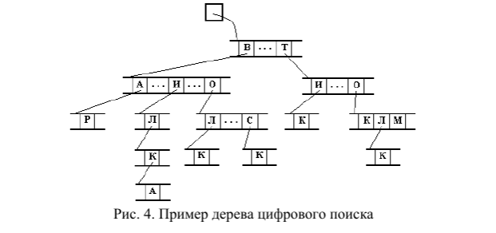
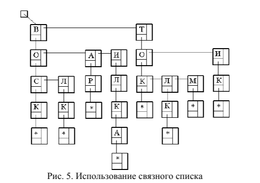

# Лабораторная работа № 4 Цифровой поиск

## Цель работы:
Изучение методов организации хранения и поиска данных с помощью дерева цифрового поиска

## Задание 
Написать программу, реализующую алгоритм цифрового поиска. Обязательно должны быть реализованы функции добавления нового слова и поиска слова в дереве. На форме должен присутствовать список введенных в дерево слов. Предусмотреть процедуру освобождения занимаемой деревом памяти.

## Результат

### Представление дерева

### Представление дерева с использованием связанных списков

### Добавление слов

### Удаление слова

### Поиск слова
