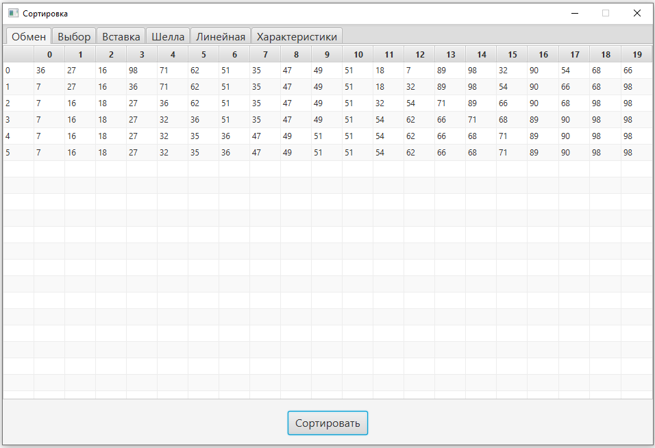
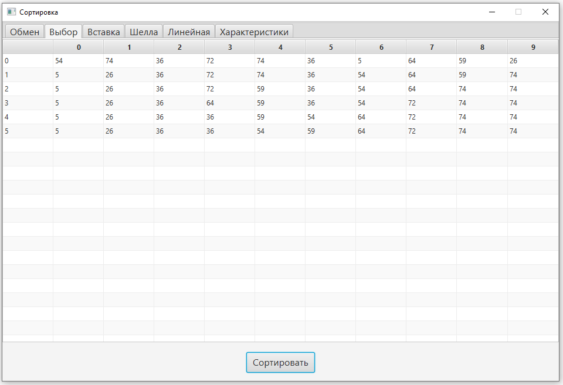
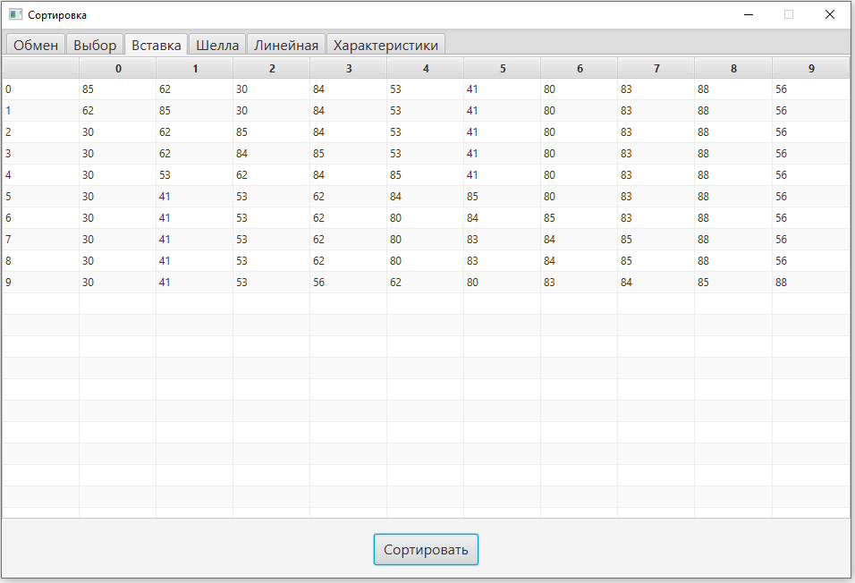
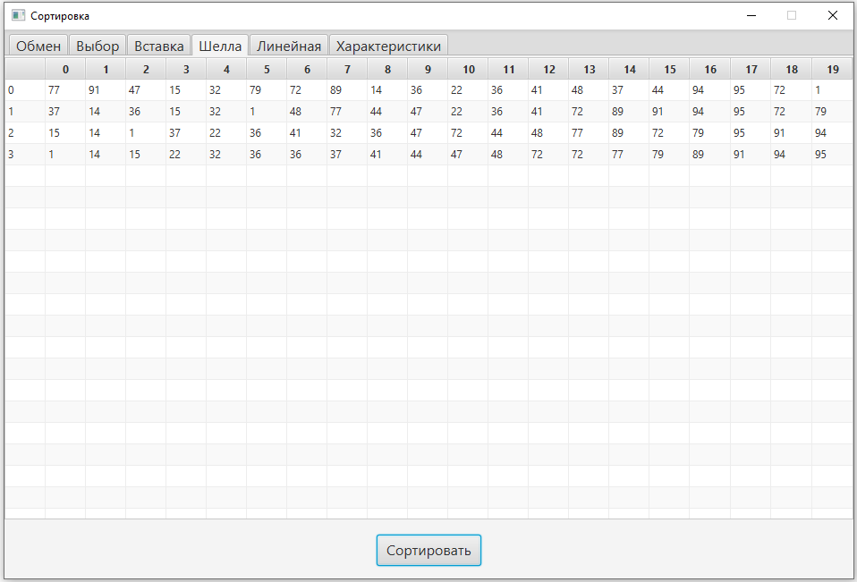
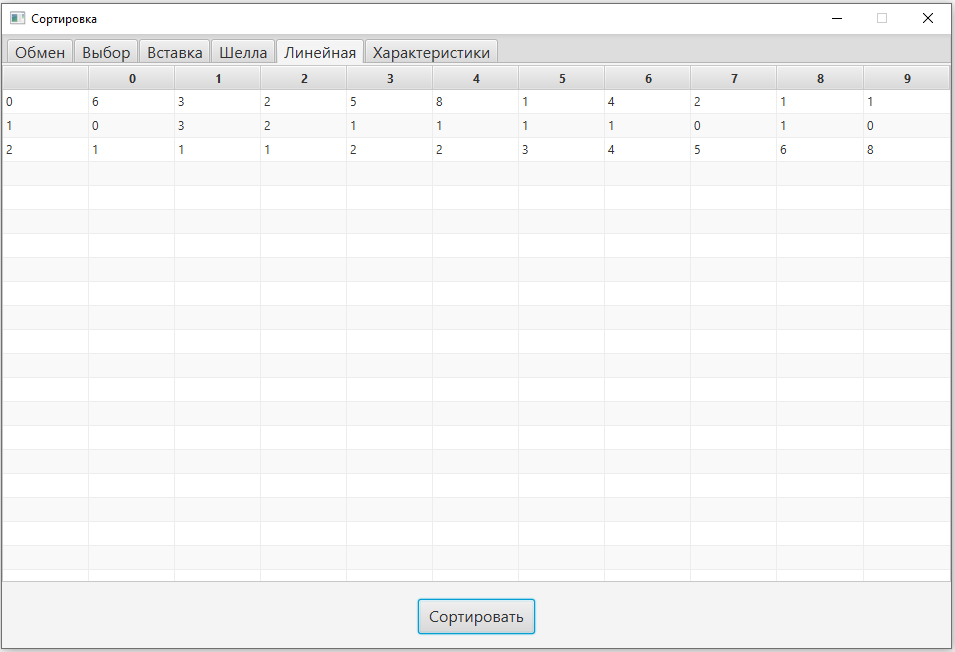
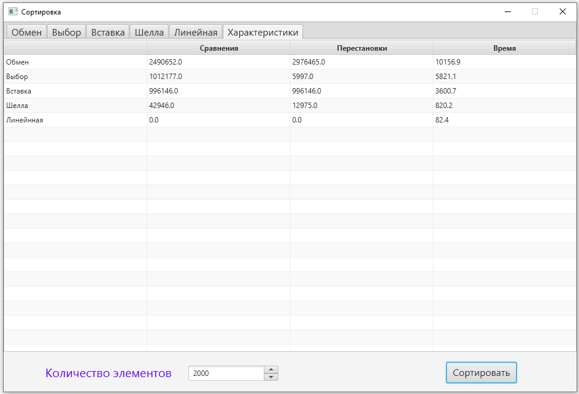

# Лабораторная работа № 5 Алгоритмы внутренней сортировки

## Цель лабораторной работы
Cравнение и анализ основных методов упорядочения данных, расположенных в оперативной памяти.

## Задание
Написать программу, состоящую из следующих пунктов.
1. Сортировка с помощью прямого обмена.
2. Сортировка с помощью прямого выбора.
3. Сортировка с помощью прямого включения.
4. Сортировка Шелла.
5. Линейная сортировка.
6. Характеристики сортировок.
В пунктах 1–5 продемонстрировать соответствующую сортировку для
массива из 10 элементов. Вывести на экран исходный массив и промежуточные
результаты каждого прохода. Для сортировки Шелла использовать массив из
20-ти элементов.

В пункте 6 для заданного в диалоге количества элементов массива
подсчитать время сортировки, число сравнений и перестановок (сдвигов) для
каждого из алгоритмов.

## Результат

## Сортировка обменом (двухнаправленная сортировка пузырьком)

## Сортировка выбором

## Сортировка вставками

## Сортировка Шелла (быстрая сортировка)

## Линейная сортировка

## Характеристики для каждого из методов внутренней сортировки
