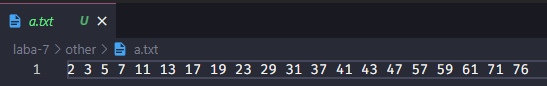

# Лабораторная работа № 7 Внешняя сортировка естественным слиянием

## Задание
Написать программу, состоящую из следующих пунктов.
1. Двухфазная сортировка естественным слиянием.
2. Однофазная сортировка естественным слиянием.
3. Характеристики сортировок.
В пунктах 1–2 продемонстрировать соответствующую сортировку для
файлов из 15 элементов. Вывести на экран исходный файл и промежуточные
результаты каждой фазы сортировки.
В пункте 3 для заданного в диалоге количества элементов файла А
подсчитать время сортировки, количество чтений из файла, количество записей
в файл и количество сравнений. Результаты сортировок поместить в отдельные
файлы В и С.  
Предусмотреть в программе возможность вывода на форму
последовательности значений заданного в диалоге файла (А, В или С) в
интервале от t до k, где t<k и k<n

## Результат

### Исходнные данные (набор чисел)

### После сортировки

### Последнее состояние промежуточных файлов
